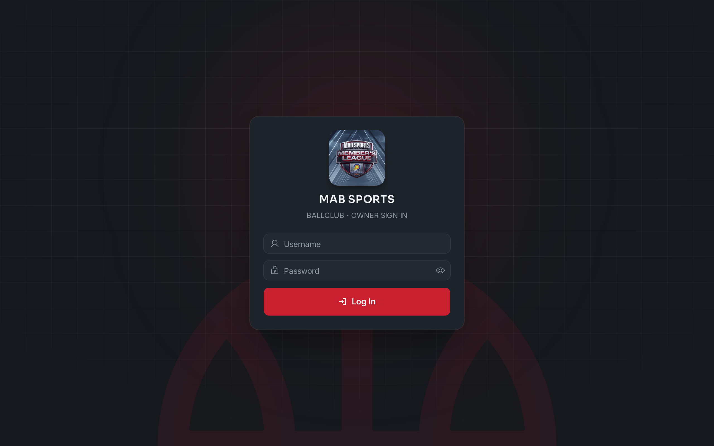

# MAB Sports Ballclub

A simple web app for running a basketball ballclub. It helps whoever manages the
club keep track of game sessions, who's playing, who has paid, and the list of
members, all from a clean dashboard on a phone or computer.

**Try it here: https://mab-ballclub.vercel.app**

## What you can do

- **Run a game session.** Start a session, see everyone lined up in the queue,
  and add walk-in players on the spot.
- **Let players join themselves.** Share a link (or code) and players can request
  to join a session from their own phone. You approve or decline each request.
- **Track payments.** Set a fee for a session and tap each player as paid. The
  app adds up how much has been collected and your total revenue.
- **Keep a member list.** Save your regular players' names and phone numbers.
  Open any member to see their history: sessions they've played and what they've paid.
- **See the big picture.** The dashboard shows totals, recent activity, and simple
  charts at a glance.
- **Manage who's in charge.** Add or remove other owner accounts who can help run
  the club.
- **Export your data.** Download a session's list or your whole member directory
  as a spreadsheet (CSV) whenever you need it.

## How to use it

1. Open the app: https://mab-ballclub.vercel.app
2. Sign in with your owner username and password.
3. Use the menu (sidebar on a computer, bottom bar on a phone) to move between the
   Dashboard, History, Session, Members, Owners, and Profile screens.
4. To let players join, open a Session and share its join link. Approve requests
   as they come in.

That's it. Everything saves automatically.

## Good to know

- It works on both phones and computers.
- Players who join do **not** need an account, only the owners sign in.
- Your login stays active on your device until you log out.

## For developers

This folder is the app's front end (what you see in the browser), built with
Vue 3 and Vite. The behind-the-scenes part lives on the
[`backend`](https://github.com/adam-ctrlc/ballclub-app/tree/backend) branch.
Setup and contribution steps are in [CONTRIBUTING.md](./CONTRIBUTING.md).

## License

Free to use and build on under the Apache License 2.0. See [LICENSE](./LICENSE).
